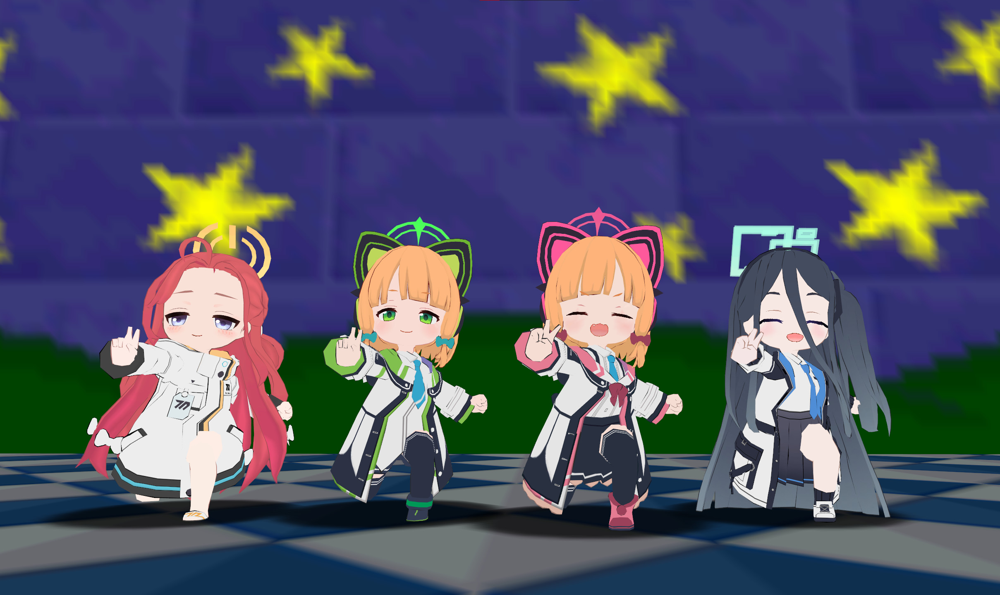

# [CS/CMD] ブルーアーカイブ



Game Development Department Club (and others) from Blue Archive ported to [sm64coopdx](https://sm64coopdx.com/)

<hr />

## Table

1. [Playable Characters](#playable-characters)
   - [Abydos](#abydos)
   - [Millennium](#millennium)
   - [Trinity](#trinity)
   - [Hyakkiyako](#hyakkiyako)
   - [Gehenna](#gehenna)
   - [Shanhaijing](#shanhaijing)
   - [Valkyrie](#valkyrie)
   - [Red Winter](#red-winter)
   - [Arius](#arius)
   - [SRT](#srt)
   - [Highlander Railroad Academy](#highlander-railroad-academy)
   - [Wildhunt](#wildhunt)
   - [ETC](#etc)
2. [Installation and Usage](#installation-and-usage)
   - [CMD](#cmd)
   - [Character Select [CS]](#character-select-cs)

## Playable Characters

<hr />
<div align="center">
  <h2>
    --<b><u>You</u></b> are playable/GSC--
  </h2>
  
</div>
 <hr />
<div align="center">
  <h2>Abydos</h2>

</div>
<div align="center">
  <hr />
  <h2>Millennium</h2>
 
</div>
<div align="center">
  <hr />
  <h2>Trinity</h2>

</div>
<div align="center">
  <hr />
  <h2>Hyakkiyako</h2>

</div>
<div align="center">
  <hr />
  <h2>Gehenna</h2>

</div>
<div align="center">
  <hr />
  <h2>Shanhaijing</h2>

</div>
<div align="center">
  <hr />
  <h2>Valkyrie</h2>
  <br />
  <hr />
  <h2>Red Winter</h2>
  
</div>
<div align="center">
  <hr />
  <h2>Arius</h2>
  <br />
  <hr />
  <h2>SRT</h2>
  
</div>
<hr />
<div align="center">
  <h2>Highlander Railroad Academy</h2>
  <br />
  <hr />
  <h2>Wildhunt</h2>
  <br>[Wildhunt_TwinBraid_Mob_Here]
</div>
<div align="center">
  <hr />
  <h2>ETC</h2>
  
</div>
</div>

<hr />

## Installation and Usage

- [Download](https://gamebanana.com/mods/478354) and extract the mod to:
  - `sm64coopdx\mods\` **OR**
  - `%userprofile%\AppData\Roaming\sm64coopdx\mods`

- To enable the mod as a host, go to `Host > Mods` and enable the following:
  - `Blue Archive Main` - Required for the mods to work
  - `Blue Archive Vol. 1-## or GDD` - Enable the packs of your choice

> [!WARNING]
> If you are updating the mod, please remove old versions of the mod before installing. Do not Overwrite.

## CMD

**To use one of the characters, open the chatbox [Enter] and type in-game:**

```
/ba [character]
```

**Replace [character] with:**

```
momoi
midori
yuzu
alice
or the character of your choice
```

**If a character has an alt**, you can type `/ba [character]2` or `/ba [character]3`. 

**To get a list of characters, type `/ba list`**

It will show a window with available character names:


To de-activate the mod, type `/ba off`.

## Character Select [CS]

<div align="center">
  
</div>
</br>

**Download the latest version of CS from [here](https://mods.sm64coopdx.com/mods/character-select.149/) or their [repo](https://github.com/Squishy6094/character-select-coop/releases).**

> [!WARNING]
> If you are updating CS, please remove old versions of CS before installing. Do not Overwrite.

- Enable `Character Select` along with the the BA mod.
- To open the CS menu, type `/char-select`
- Alternatively, a controller keybind may be set to open the menu. (It might be on by default)
  - Open the start pause menu and press the button bound to `Z`. (Default: Left trigger on Xbox controllers)
- Press Left or Right on a character in the CS menu to switch between alts (if they have one)

---
